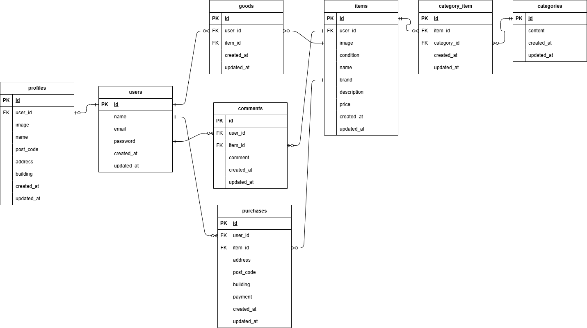

## アプリケーション名

フリマアプリ

## プロジェクト概要

アイテムの出品と購入を行うためのフリマアプリを開発する

## 環境構築
```
Docker ビルド  
・git clone git@github.com:yuukuroda/kuroda-freemarket.git  
・docker-compose up -d --build

Laravel 環境構築  
・docker-compose exec php bash  
・composer install  
・cp .env.example .env、環境変数を以下に変更

　　DB_CONNECTION=mysql
　　DB_HOST=mysql
　　DB_PORT=3306
　　DB_DATABASE=laravel_db
　　DB_USERNAME=laravel_user
　　DB_PASSWORD=laravel_pass

・php artisan migrate  
・php artisan key:generate  
・php artisan db:seed
・php artisan storage:link

"The stream or file could not be opened"エラーが発生した場合  
src ディレクトリにある storage ディレクトリに権限を設定  
chmod -R 777 storage
```

## テストユーザー

```
user1
・email:test@example.com
・password:password

user2
・email:ymd@ymd.com
・password:yyyyuuuu

シーディングデータの商品はuser1が5個、user2が5個出品しています。
```

## テスト環境構築
```
テスト用のデータベースを作成
・mysql -u root -p
・CREATE DATABASE demo_test;

.env.testingの作成
・cp .env .env.testing、環境変数を以下に変更

　APP_ENV=test
　APP_KEY=
　DB_DATABASE=demo_test
　DB_USERNAME=root
　DB_PASSWORD=root

・php artisan key:generate --env=testing
・php artisan config:clear

テスト用データベースのテーブルを作成
・php artisan migrate --env=testing

```

## URL
```
・商品一覧：http://localhost
・商品一覧（マイリスト）：http://localhost/?tab=mylist
・商品検索（おすすめ内）：http://localhost/?keyword=商品名
・商品検索（マイリスト内）：http://localhost/?tab=mylist&keyword=商品名
・商品詳細画面：http://localhost/item/{itemId}
・商品出品画面：http://localhost/sell
・商品購入画面：http://localhost/purchase/{itemId}
・配送先住所変更：http://localhost/purchase/address/{itemId}
・プロフィール設定：http://localhost/mypage/profile
・マイページ（出品一覧）：http://localhost/mypage?page=sell
・マイページ（購入一覧）：http://localhost/mypage?page=buy
・ログイン画面：http://localhost/login
・会員登録画面：http://localhost/register
※ {itemId} には商品のID（数字）が入ります。
```

## 使用技術（実行環境）
```
・php:8.1.33  
・laravel:8.83.8  
・mysql:8.0.26  
・nginx:1.21.1
```

## ER 図


